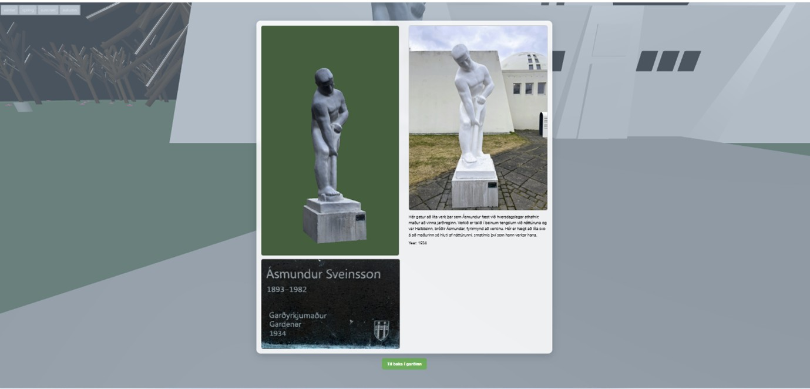
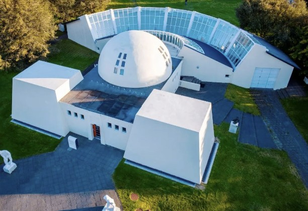
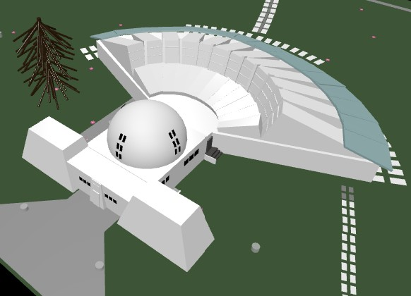

# Ásmundarsafnið í 3D – Einstaklingsverkefni í Vefforritun 2

## Inngangur

Hugmyndin að verkefninu kom þegar ég var í Tölvugrafík á seinustu haustönn. Ásmundarsafnið fannst mér bæði skemmtilegt og aðgengilegt viðfangsefni sem bauð upp á mikla möguleika til að þróa. Verkefnið er þrívíddarútgáfa af Ásmundarsafni þar sem hægt er að smella á styttur og fá upplýsingar um þær. Stytturnar eru skannaðar útgáfur af styttunum og birtast þar með í góðum gæðum.

### Einkunnargjöf samkvæmt verkefnisviðmiðum:

- **Blender-hönnun á safninu**: 20%
- **Árstíðarvirkni**: 20%
- **Smellt á styttu með upplýsingum**: 20%
- **Niðurhal á styttu**: 20%
- **CSS og útlit**: 20%

---

## Útfærsla

Ég setti mér þessi skilyrði:

- **Framendi:**
  - `Three.js` sá um þrívíddarumhverfið og alla gagnvirkni tengda því.
  - `CSS` sá um útlit texta, animation og kvikun.
- **Greining og verkplan:**
  - Verkefnið greint niður í vikuleg markmið og fylgt vel eftir.
- **Engin notkun á Node.js:**
  - Verkefnið notar eingöngu `Three.js`.

---

## Verkferli

Ég byrjaði í viku 6 og lauk verkefninu í viku 13 (15. apríl). Skönnun styttanna tók lengri tíma en áætlað var, en ég hélt mig nokkuð vel við verkplanið.

### Tímalína:

- **Vika 6**: Uppsetning á umhverfi. Kassi fyrir safnið og plön fyrir garðinn.
- **Vika 7**: Útfærsla á árstíðaskiptingu í `seasons.js` með `switch-case`.

```js
function setSeasonBackgroundEffects(season) {
  if (scene) {
    switch (season) {
      case 'winter':
        scene.background = new THREE.Color(0xd0e8f2); // light icy blue
        break;
      case 'spring':
        scene.background = new THREE.Color(0xa1d3b8); // soft green
        break;
      case 'summer':
        scene.background = new THREE.Color(0x1ae3d8); // clear blue
        break;
      case 'autumn':
        scene.background = new THREE.Color(0x87cefa); // warm blue
        break;
    }
  }
}
```

- **Vika 8**: Myndir teknar af styttum og nöfnum. Áframhaldandi vinna í `seasons.js`.
- **Vika 9**:
  - Setti styttugögn í `JSON`-skrá.
  - Skannaði styttur með Polycam og sótti í tölvu.
  - Lærði á `raycaster` í Three.js.

```js
function onPlaceholderClick(event, camera, controls, scene) {
  mouse.x = (event.clientX / window.innerWidth) * 2 - 1;
  mouse.y = -(event.clientY / window.innerHeight) * 2 + 1;
  raycaster.setFromCamera(mouse, camera);
  const intersects = raycaster.intersectObjects(placeholderObjects, true);
  if (intersects.length > 0) {
    const placeholder = intersects[0].object;
    detailViewActive = true;
    controls.enabled = false;
    if (radglaningEl) radglaningEl.style.display = 'none';
    openStatueModal(placeholder.userData, controls);
    loadStatueModel(placeholder.userData, placeholder, camera, controls, scene);
  }
}
```

- **Vika 10**: Reyndi að hýsa á Render – of stór gögn. Bætti við placeholder-styttum í stað skannaðra.
- **Vika 11**: Lazy loading útfært til að bæta hraða og upplifun.
- **Vika 12**: Popup-gluggar fyrir styttur og CSS og hönnun á húsinu unnin áfram.
  
- **Vika 13**: Lokafrágangur á virkni og útliti.

---

## Tækni

Verkefnið notar:

- [`Three.js`](https://threejs.org): Fyrir gagnvirkt þrívíddarumhverfi.
- `CSS`: Fyrir texta, stíl og kvikanir.
- `JSON`: Til að geyma og sækja upplýsingar um styttur.
- `Polycam`: Til að skanna styttur í 3D útgáfu.
- `Google Earth`: Til að herma eftir húsinu í Blender.

---

## Hvað gekk vel?

- Það gekk vel að birta gögnin og fá upplýsingar um hverja styttu.
- Forritið mitt var ágætlega vel skipulagt og býður upp á að bæta auðveldlega við virkni, sem ég mun halda áfram með eftir áfangann.
- Það gekk vel að búa til húsið af Ásmundarsafni, þrátt fyrir að það hafi tekið smá æfingu.

---

## Hvað gekk illa?

- Gögnin frá Polycam voru of stór í góðum gæðum – erfitt að minnka án gæðataps. Ef ég minnkaði hnútafjöldann gat ég ekki notað útlitið á efninu(e.texture).
- Hýsing var áskorun – Render gat ekki tekið við öllum gögnum vegna stærðar á styttunum.

---

## Hvað var áhugavert?

- Lazy loading gerði gæfumuninn – hægt að hafa mikið magn gagna án þess að hægja á vefnum.
- Lærdómur á notkun hljóðs og `Three.js raycaster` var sérstaklega skemmtilegur og gagnlegur.
- Verkefnið breyttist mjög mikið og ég lærði að það er sniðugt að gefa sér nokkrar vikur að finna hugmynd að verkefni. Til dæmis var fyrsta útgáfan af verkefninu að hægt er að smella á staðsetta hnappa í garðinum og þá birtist mynd af styttunni. Þegar sú hugmynd er borin saman við nýjustu útgáfuna af verkefninu er að mínu mati meira varið í nýjustu útgáfuna.

---

## Samanburður á raunverulegu safni og 3D-módeli

Eins og sést er safnið afar fallegt og hefur nokkuð augljós form í sér.
**Raunverulegt safn:**  


Það gekk vel að gera framhliðina af safninu nokkuð líka en var mér smá erfiði að hanna lögunina á sýningarsalnum.
**3D útgáfan í Blender:**  


---

## Áframhald á verkefni

- Ég ætla að athuga hvort hægt sé að sækja um einhverja styrki til að halda áfram með verkefnið.
- Ég mun bæta við animation virkni í Blender sem verður spennandi að læra
- Ég ætla að læra hvernig ég get unnið og lagfært stytturnar sem ég hef skannað þannig að ég vil rannsaka það aðeins betur.
- Ég vil búa til gagnagrunn sem heldur utan um allar stytturnar -það mun vera verkefni sem hefur sprottið uppúr þessu einstaklingsverkefni. 

---

## Lokaorð

Ég hef lært að tvinna betur listina við tækni og er búin að læra afar mikið útfrá þessu verkefni. Ég hef lært að búa til módellíkön með skönnunaraðferð. Ég hef lært enn meir á CSS virkni og hvernig á að gera vef responsive. Ég hef unnið með Blender og hannað safn frá grunni. 

---
